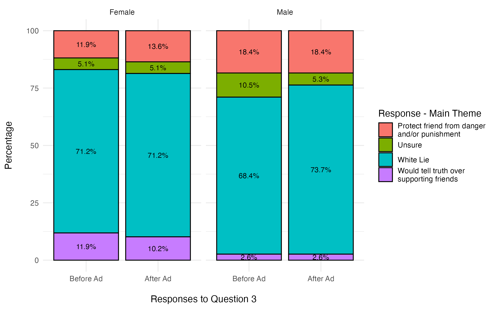

# Overview

This is the repo for my Spring 2025 capstone project. I conducted qualitative analysis for a misinformation pilot study 
that created and tested audio and visual advertisements that could possibly counteract misinformation. A total of 594 written 
responses were collected from 99 participants, who were asked the following:

1. _What are some reasons you think people are attracted to radical groups?_
2. _What are some reasons you think people believe false ideas circulating online?_
3. _Describe a situation in which supporting friends would be more important than telling the truth._

Based on a composite score that I developed, I found that participants’ views about misinformation remained
mostly unchanged in the written responses that were capture before and after being shown an ad, but participants' responses became longer after being
show a visual ad vs. an audio-only ad. The most interesting responses came from Question 3 when based on gender: Males are 1.4 times as likely as females to tell a white lie and protect their friends, while 
females are 3.25 times as likely to tell the truth over supporting their friends. 

# Directory Structure

There are three main sources of information: 

1. The original dataset: "analysis/data/lying_data.xlsx"
2. R Studio Markdown file: "analysis/reports/Final Report.Rmd"
3. PDF of the final report: "analysis/reports/Final Report.pdf"
